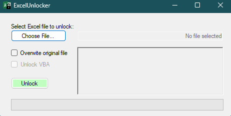

# Excel Unlocker 🔐 

> [!NOTE]
> *This is a lightweight, portable (requires no installation) `C#` application that is used to remove worksheet and VBA
> protection from Microsoft Excel `.xlsx` (Default), `.xlsm` (Macro Enabled), and `.xlam` (Excel Add-Ins) files.*

## Contents

- [Excel Unlocker 🔐 ](#excel-unlocker--)
  - [Contents](#contents)
  - [Demo](#demo)
  - [Installation](#installation)
  - [Usage](#usage)
  - [Methodology](#methodology)
    - [Worksheet Password Removal](#worksheet-password-removal)
    - [VBA Password Removal](#vba-password-removal)
  - [License](#license)

## Demo

Below is a screenshot and a demo GIF of the Excel Unlocker tool in action:

<hr>

<p align="center">
  <stong>Screentshot:</strong>
  <br>
  
</p>

<hr>

<p align="center">
  <stong>Demo GIF:</strong>
  <br>
  <video width="65%" controls>
    <source src="assets/img/demo.mp4" type="video/mp4">
  </video>
</p>

## Installation

> [!NOTE]
> - **Portable** - Excel Unlocker is a standalone executable that requires no installation. Simply download and run it.
> - **Windows Only** - This tool is designed to run on Windows operating systems only.

- You can find the compiled C# executable in the `build/` directory of this repository: [ExcelUnlocker.exe](Build/ExcelUnlocker.exe).
- You can also download the latest release from the [Releases](https://github.com/jimbrig/ExcelUnlocker/releases/) page.

You can also install via `gh-cli`:

```powershell
#!/bin/powershell

$DownloadPath = "$Env:USERPROFILE\Downloads\ExcelUnlocker.exe"

gh release download -R jimbrig/ExcelUnlocker -p "*.exe" -O $DownloadPath
```

## Usage

- **Worksheet Password Removal**:
  - Drag-and-drop the Excel file onto the `ExcelUnlocker.exe` executable.
  - Alternatively, run the executable and select the file from the file dialog.
  - The unlocked file will be saved in the same directory as the original file with the suffix `_unlocked`.

- **VBA Password Removal**:
  - Run the executable and select the file from the file dialog.
  - The unlocked file will be saved in the same directory as the original file with the suffix `_unlocked`.
  - Open the workbook in Excel, accept any errors that appear, save, and then re-open the workbook.

See the [Methodology](#methodology) section for more information on how this tool works below.

## Methodology

- Excel Unlocker is a simple, lightweight application that uses the `OpenXML` library to manipulate Excel files.
- It can remove both worksheet and VBA password protection from Excel files.
- The tool is designed to be portable and requires no installation.
- It is a standalone executable that can be run on any Windows machine.
- The tool is designed to be user-friendly and requires no technical knowledge to operate.
- The tool is designed to be safe and non-destructive, but it is always recommended to create a backup of your files before using it.

### Worksheet Password Removal

> [!NOTE]
> Excel Unlocker, written in `C#`, will take a workbook, extract it into a temporary folder, remove the `<SheetProtection>`
> tag from all worksheets, and re-zip it back into the original format (`.xlsx` or `.xlsm`) in the original directory.

- Modern Excel workbooks are cleverly-hiding compressed `.ZIP` archives containing separate `XML` files for each worksheet.
- The worksheet `XML` files themselves will have a `<SheetProtection>` tag containing the *hashed password* (`SHA256`), among other things.
- If this tag is removed, the worksheet will no longer be protected - not just without a password, but it will not be locked at all.
- As removing this protection is a consistent, reproducible procedure, it can be easily automated.

> [!TIP]
> You can test this out yourself by performing the following steps:
> 1. Rename the Excel file by adding a `.zip` extension at the end to create an archive.
> 2. Extract the contents of the archive to a folder (or simply open it with an archive manager).
> 3. Navigate to the `xl\worksheets` folder and open any of the `.xml` files in a text editor (you will want to pick a sheet the has password protection).
>     - *Note: The sheet name mappings are listed in the `xl\workbook.xml` file or you can find them from the VBE editor in Excel.*
> 4. Open this `XML` file in your preferred text editor and search (`Ctrl+F`) for the word `protect`.
> 5. You will find a `<SheetProtection>` tag with a `password` attribute. This is the hashed password.
> 6. Delete the entire `<SheetProtection>` tag and save the file.
> 7. Re-zip the contents of the folder back into a `.zip` archive.
> 8. Rename the archive back to `.xlsx` (or `xlsm`) and open it in Excel. The sheet will no longer be protected.

### VBA Password Removal

- Excel Unlocker can also remove password protection from workbook-specific VBA projects. This works even if the VBA is view-locked (can't look at the code without a password).
- Removing VBA protection involves `HEX` editing, and it is **strongly** recommended that you create a backup copy of the workbook prior to attempting.
- When run, the `VBAProject.bin` file will be read into a buffer, parsed as `HEX`, and a set of 3 specific `HEX` couplets will be replaced - these are what tells the VBA editor that protection is in place.
- After this is done, you will have to re-open the workbook - which will cause an error. This is normal! Do not panic! Open the VBA editor (`ALT-F11`), accept any errors that appear, save, and then finally re-open your newly freed workbook.

> [!WARNING]
> **This process is irreversible!** If you have a password-protected VBA project, and you run this tool, you will lose the password. Make sure you have a backup!

***

## License

This project is licensed under the MIT License - see the [LICENSE](LICENSE) file for details.

***

&copy; Jimmy Briggs | 2024
